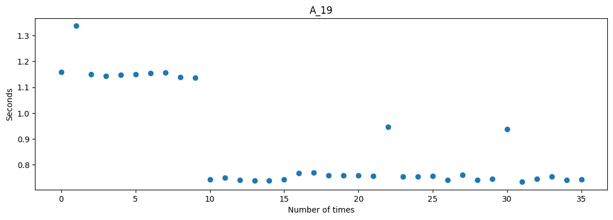

# StressTesting
這個專案大約是在半年前寫的，用來進行網站壓力測試。

輸入網址和請求次數後執行程式。

本專案本來打算製作成桌面應用程式，但因為不明的電腦環境原因，導致無法在本基開發，因此修改在colab開發的版本後與github連結。

網頁同步請求是使用[grequests](https://github.com/spyoungtech/grequests)套件進行修改，並將結果資料儲存成CSV檔案及圖表。

This project was designed about half a year ago.

It's used for  stress testing for website.

You can enter your web url and fruquency.

I use colab and connect it to github, because there are some errors in my environment.

Due to those reason, I cann't create a GUI for this project.

The main feature is [grequests](https://github.com/spyoungtech/grequests).
I add some code in this package.

